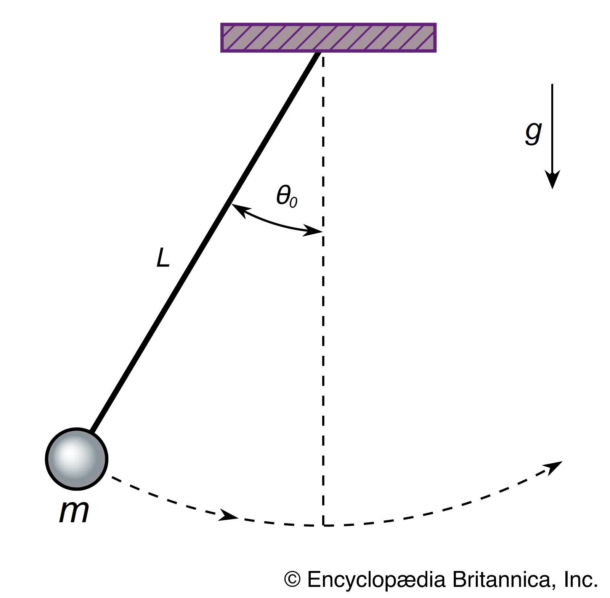

<p align="center" width="100%">
    
</p>

---

<p align="center">
    <a href="https://pypi.org/project/nodimo/" alt="Python">
        </a>
    <a href="" alt="Documentation">
        </a>
    <a href="" alt="Github Downloads">
        </a>
    <a href="https://anaconda.org/rodrigopcastro018/nodimo" alt="Anaconda Downloads">
        </a>
    <a href="https://github.com/jupyter/notebook" alt="Jupyter">
        </a>
    <a href="https://github.com/rodrigopcastro018/nodimo/blob/main/LICENSE" alt="License">
        </a>
</p>

# Nodimo
The main purpose of Nodimo is to transform a dimensional relationship between variables into a nondimensional one. The variables are gathered in nondimensional groups such that the number of groups is lower than the number of variables. The resulting nondimensional model is, at the same time, a generalization and simplification of the dimensional model.

Nodimo supports any number of dimensions and variables. It can be used for applications in science, engineering, economics and finance. The resulting nondimensional groups can be used as the basis for further studies in similarity and model testing.

## Installation
Nodimo and its dependencies (`numpy` and `sympy`) are installed by:
```shell
pip install nodimo
```

When running Nodimo on the terminal, make sure that the terminal supports Unicode characters. For the best experience, it is recommended the use of [jupyter notebook](https://github.com/jupyter/notebook).

## Getting started
### Basic example
Simple pendulum:

<p align="center" width="100%">
    
</p>

The nondimensional model for the pendulum's period as a function of the other variables is built and displayed as:
```python
from nodimo import Variable, NonDimensionalModel

# Variables' dimensions: Mass (M), Length (L) and Time (T)
T = Variable('T', M=0, L=0, T=1, dependent=True)  # period
L = Variable('L', M=0, L=1, T=0, scaling=True)    # length
m = Variable('m', M=1, L=0, T=0)                  # mass
g = Variable('g', M=0, L=1, T=-2, scaling=True)   # gravity
t0 = Variable('theta_0')                          # initial angle

ndmodel = NonDimensionalModel(T, L, m, g, t0)
ndmodel.show()
```

And the result is:
```math
\displaystyle \frac{T g^{\frac{1}{2}}}{L^{\frac{1}{2}}} = \Pi{\left(\theta_{0} \right)}
```

For more functionalities and examples, check the documentation.

## License
Nodimo is open-source and released under the [MIT License](LICENSE)